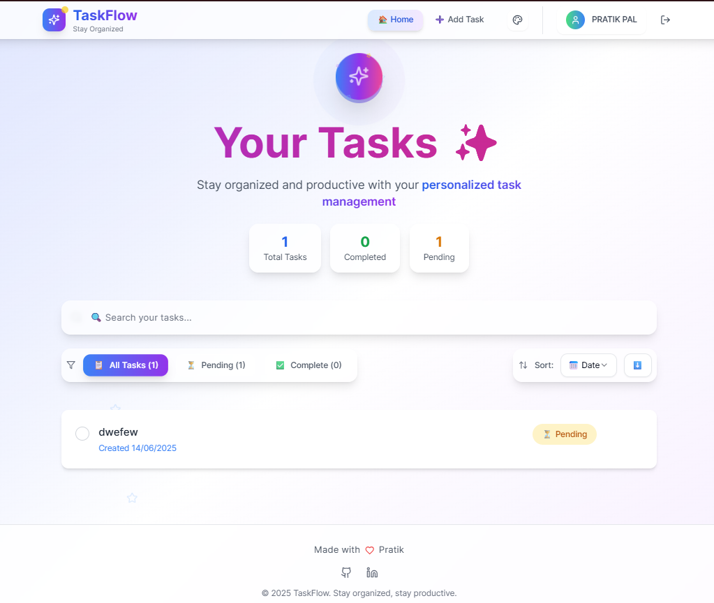

# TaskFlow

A modern and responsive to-do list application to help you stay organized and productive.

## Features

- ✅ Add, edit,Update and delete tasks
- ✅ Mark tasks as completed
- ✅ Filter tasks by status
- ✅ Responsive design for all devices
- ✅ User authentication (if implemented)
- ✅ Clean and intuitive UI

## Demo



## Getting Started

### Prerequisites

- [Node.js](https://nodejs.org/) (v16 or higher recommended)
- [npm](https://www.npmjs.com/) or [yarn](https://yarnpkg.com/)

### Installation

1. **Clone the repository:**
   ```sh
   git clone https://github.com/luffy229/keep-it-organized-tasks.git
   cd keep-it-organized-tasks
   ```

2. **Install dependencies:**

   For the backend:
   ```sh
   cd backend
   npm install
   ```

   For the frontend:
   ```sh
   cd ../frontend
   npm install
   ```

3. **Set up environment variables:**

   - Copy `.env.example` to `.env` in the `backend` folder and fill in the required values.

4. **Run the application:**

   Start the backend server:
   ```sh
   cd backend
   npm start
   ```

   Start the frontend development server:
   ```sh
   cd ../frontend
   npm run dev
   ```

5. **Open your browser and visit:**
   ```
   http://localhost:3000
   ```

## Technologies Used

- **Frontend:** React, TypeScript, Vite, Tailwind CSS, shadcn/ui
- **Backend:** Node.js, Express, MongoDB (if used)
- **Icons:** lucide-react

## Folder Structure

```
keep-it-organized-tasks/
├── backend/
│   ├── models/
│   ├── routes/
│   ├── middleware/
│   ├── .env
│   └── server.js
└── frontend/
    ├── src/
    │   ├── components/
    │   ├── contexts/
    │   ├── hooks/
    │   ├── App.tsx
    │   └── main.tsx
    └── index.html
```

## Contributing

Contributions are welcome! Please open an issue or submit a pull request.

## License

This project is licensed under the MIT License.

---

**Author:** [Pratik]